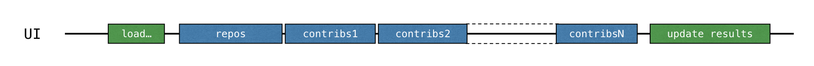
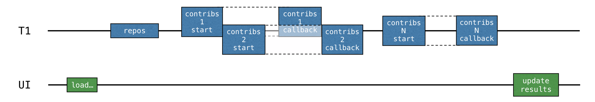
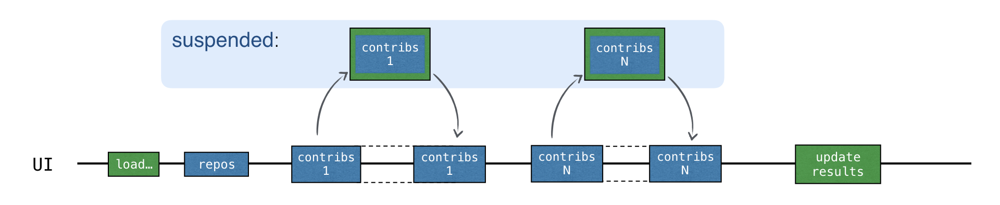
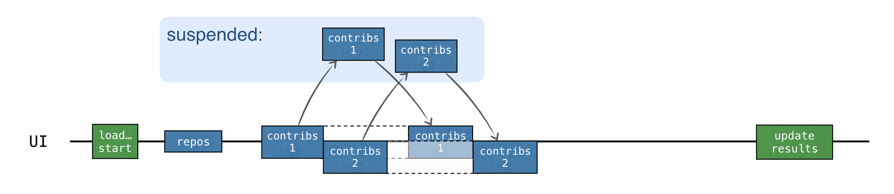

## 实践:coroutines协程和channels通道

(原文档修改日期: Last modified: 28 November 2022)

在本教程中，您将学习如何在 IntelliJ IDEA 中使用协程来执行网络请求，而不会阻塞底层线程或回调。

> 不需要事先了解协程，但您应该熟悉基本的 Kotlin 语法。

你会学到：

- 为什么以及如何使用挂起函数来执行网络请求。
- 如何使用协程并发发送请求。
- 如何使用通道在不同协程之间共享信息。

对于网络请求，您将需要 [Retrofit](https://square.github.io/retrofit/) 库，但本教程中展示的方法对于支持协程的任何其他库同样适用。

> 您可以在[项目存储库](http://github.com/kotlin-hands-on/intro-coroutines)的 `solutions` 分支上找到所有任务的解决方案。

## 在你开始前

1. 下载并安装最新版本的 IntelliJ IDEA。
2. 通过在欢迎屏幕上选择从 VCS 获取或选择 File | New | Project from Version Control 来克隆项目模板。

您也可以从命令行克隆它：`git clone https://github.com/kotlin-hands-on/intro-coroutines`

## 生成一个 GitHub developer token

您将在项目中使用 GitHub API。要获得访问权限，请提供您的 GitHub 帐户名以及密码或令牌。如果启用了双因素身份验证，则令牌就足够了。

生成一个新的 GitHub 令牌使用 GitHub API(以[您的帐户](https://github.com/settings/tokens/new)身份使用)：

  1. 指定令牌的名称，例如 `coroutines-tutorial`;
  2. 不要选择任何范围。单击页面底部的生成令牌。
  3. 复制生成的令牌。

## 运行代码

该程序加载给定组织下所有存储库的贡献者（默认名为“kotlin”）。稍后您将添加逻辑以按用户贡献的数量对用户进行排序。

  1. 打开 src/contributors/main.kt 文件并运行 main() 函数。您将看到以下窗口：(如果字体太小，可以通过改变main()函数中setDefaultFontSize(18f)的值来调整。)
  2. 在相应字段中提供您的 GitHub 用户名和令牌（或密码）。
  3. 确保在 `Variant` 下拉菜单中选择了 `BLOCKING` 选项。
  4. 单击加载贡献者。 UI 应该会冻结一段时间，然后显示贡献者列表。
  5. 打开程序输出以确保数据已加载。每次成功请求后都会记录贡献者列表。

有多种实现此逻辑的方法：使用[阻塞式请求](#阻塞式请求)或[回调](#回调)。
您会将这些解决方案与使用[协程](#协程)的解决方案进行比较，并了解如何使用[通道](#通道)在不同的协程之间共享信息。

## 阻塞式请求

您将使用 Retrofit 库向 GitHub 执行 HTTP 请求。它允许请求给定组织下的存储库列表和每个存储库的贡献者列表：

```kotlin
interface GitHubService {
    @GET("orgs/{org}/repos?per_page=100")
    fun getOrgReposCall(
        @Path("org") org: String
    ): Call<List<Repo>>

    @GET("repos/{owner}/{repo}/contributors?per_page=100")
    fun getRepoContributorsCall(
        @Path("owner") owner: String,
        @Path("repo") repo: String
    ): Call<List<User>>
}
```

`loadContributorsBlocking()` 函数使用此 API 来获取给定组织的贡献者列表。

  1. 打开 `src/tasks/Request1Blocking.kt` 查看其实现：
  ```kotlin
  fun loadContributorsBlocking(service: GitHubService, req: RequestData): List<User> {
        val repos = service
            .getOrgReposCall(req.org)   // #1
            .execute()                  // #2
            .also { logRepos(req, it) } // #3
            .body() ?: emptyList()      // #4
    
        return repos.flatMap { repo ->
            service
                .getRepoContributorsCall(req.org, repo.name) // #1
                .execute()                                   // #2
                .also { logUsers(repo, it) }                 // #3
                .bodyList()                                  // #4
        }.aggregate()
    }
  ```
    - 首先，您获得给定组织下的存储库列表并将其存储在存储库列表中。然后对于每个存储库，请求贡献者列表，并将所有列表合并为一个最终的贡献者列表。
    - `getOrgReposCall()` 和 `getRepoContributorsCall()` 都返回 `*Call` 类 (`#1`) 的一个实例。此时，没有发送任何请求。
    - 然后调用 `*Call.execute()` 来执行请求（`#2`）.`execute()` 是阻塞底层线程的同步调用。
    - 当您收到响应时，将通过调用特定的 `logRepos()` 和 `logUsers()` 函数 (`#3`) 来记录结果。如果 HTTP 响应包含错误，则此错误将记录在此处。
    - 最后，获取响应的正文，其中包含您需要的数据。对于本教程，您将使用一个空列表作为结果以防出现错误，并且您将记录相应的错误 (`#4`)
  2. 为了避免重复 `.body() ?: emptyList()`，声明了一个扩展函数 `bodyList()`：
  ```kotlin
  fun <T> Response<List<T>>.bodyList(): List<T> {
        return body() ?: emptyList()
    }
  ```
  3. 再次运行程序，看看 IntelliJ IDEA 中的系统输出。它应该有这样的东西：
  ```text
  1770 [AWT-EventQueue-0] INFO  Contributors - kotlin: loaded 40 repos
  2025 [AWT-EventQueue-0] INFO  Contributors - kotlin-examples: loaded 23 contributors
  2229 [AWT-EventQueue-0] INFO  Contributors - kotlin-koans: loaded 45 contributors
  ...
  ```
    - 每行的第一项是程序启动后经过的毫秒数，然后是方括号中的线程名称。可以看到加载请求是从哪个线程调用的。
    - 每行的最后一项是实际消息：加载了多少存储库或贡献者。

此日志输出表明所有结果都是从主线程记录的。当您使用 BLOCKING 选项运行代码时，窗口会冻结并且在加载完成之前不会对输入做出反应。
所有请求都从与称为 loadContributorsBlocking() 的线程相同的线程执行，这是主 UI 线程（在 Swing 中，它是一个 AWT 事件调度线程）。这个主线程被阻塞，这就是 UI 被冻结的原因：



加载贡献者列表后，结果会更新。
  4. 在 src/contributors/Contributors.kt 中，找到负责选择贡献者加载方式的 loadContributors() 函数，并查看 loadContributorsBlocking() 的调用方式：
  ```kotlin
  when (getSelectedVariant()) {
        BLOCKING -> { // Blocking UI thread
            val users = loadContributorsBlocking(service, req)
            updateResults(users, startTime)
        }
    }
  ```
  - updateResults() 调用紧跟在 loadContributorsBlocking() 调用之后。
  - updateResults() 更新 UI，因此必须始终从 UI 线程调用它。
  - 由于 loadContributorsBlocking() 也是从 UI 线程调用的，因此 UI 线程被阻塞并且 UI 被冻结。

### [Task 1](https://kotlinlang.org/docs/coroutines-and-channels.html#task-1)

第一个任务帮助您熟悉任务域。目前，每个贡献者的名字都会重复多次，每个贡献者参与的项目一次。实现 `aggregate()` 函数组合用户，以便每个贡献者只添加一次。 
`User.contributions` 属性应包含给定用户对所有项目的贡献总数。结果列表应根据贡献数量降序排列。

打开 `src/tasks/Aggregation.kt` 并实现 `List<User>.aggregate()` 函数。用户应按贡献总数排序。

相应的测试文件 `test/tasks/AggregationKtTest.kt` 显示了预期结果的示例。

> 您可以使用 IntelliJ IDEA 快捷键 Ctrl+Shift+T/⇧ ⌘ T 自动在源代码和测试类之间跳转。

执行此任务后，“kotlin”组织的结果列表应类似于以下内容：


Solution for task 1:

1. 要按登录名对用户进行分组，请使用 groupBy()，它会返回一个从登录名到不同存储库中使用此登录名的用户的所有匹配项的映射。
2. 对于每个映射条目，计算每个用户的贡献总数，并根据给定名称和贡献总数创建 User 类的新实例。
3. 按降序对结果列表进行排序：
```kotlin
fun List<User>.aggregate(): List<User> =
    groupBy { it.login }
        .map { (login, group) -> User(login, group.sumOf { it.contributions }) }
        .sortedByDescending { it.contributions }
```

另一种解决方案是使用 groupingBy() 函数而不是 groupBy()。

## 回调

以前的解决方案有效，但它会阻塞线程并因此冻结 UI。避免这种情况的传统方法是使用 callbacks 。

您可以将它提取到单独的回调（通常是 lambda）中，并将该 lambda 传递给调用方，以便稍后调用，而不是调用应在操作完成后立即调用的代码。

要使 UI 响应，您可以将整个计算移动到一个单独的线程或切换到 Retrofit API，它使用回调而不是阻塞调用。

### 使用后台线程

1. 打开 `src/tasks/Request2Background.kt` 并查看其实现。首先，整个计算被转移到不同的线程。 `thread()` 函数启动一个新线程：
```kotlin
thread {
    loadContributorsBlocking(service, req)
}
```

现在所有的加载都被转移到一个单独的线程，主线程是空闲的，可以被其他任务占用：


2. `loadContributorsBackground()` 函数的签名发生了变化。它需要一个 `updateResults()` 回调作为在所有加载完成后调用它的最后一个参数： 
```kotlin
fun loadContributorsBackground(
    service: GitHubService, req: RequestData,
    updateResults: (List<User>) -> Unit
)
```

3. 现在，当调用 `loadContributorsBackground()` 时，`updateResults()` 调用进入回调，而不是像以前那样立即调用：
```kotlin
loadContributorsBackground(service, req) { users ->
    SwingUtilities.invokeLater {
        updateResults(users, startTime)
    }
}
```

通过调用 `SwingUtilities.invokeLater`，您可以确保更新结果的 `updateResults()` 调用发生在主 UI 线程（AWT 事件调度线程）上。

但是，如果您尝试通过 `BACKGROUND` 选项加载贡献者，您会看到列表已更新但没有任何变化。 

### [Task 2](https://kotlinlang.org/docs/coroutines-and-channels.html#task-2)

修复 `src/tasks/Request2Background.kt` 中的 `loadContributorsBackground()` 函数，以便在 UI 中显示结果列表。

Solution for task 2:

如果您尝试加载贡献者，您可以在日志中看到贡献者已加载但未显示结果。要解决此问题，请对生成的用户列表调用 `updateResults()`：

```kotlin
thread {
    updateResults(loadContributorsBlocking(service, req))
}
```

确保明确调用回调中传递的逻辑。否则，什么也不会发生。

### 使用 Retrofit 回调 API

在之前的解决方案中，整个加载逻辑都移到了后台线程，但这仍然不是资源的最佳利用方式。所有的加载请求都是顺序进行的，线程在等待加载结果时被阻塞，而它可能已经被其他任务占用了。
具体来说，线程可以开始加载另一个请求以更早地接收整个结果。

处理每个存储库的数据应分为两部分：加载和处理结果响应。第二个处理部分应该提取到回调中。

然后可以在收到前一个存储库的结果之前开始加载每个存储库（并调用相应的回调）：



Retrofit 回调 API 可以帮助实现这一点。 `Call.enqueue()` 函数启动 HTTP 请求并将回调作为参数。在此回调中，您需要指定每次请求后需要执行的操作。

打开 `src/tasks/Request3Callbacks.kt` 并查看使用此 API 的 `loadContributorsCallbacks()` 的实现：

```kotlin
fun loadContributorsCallbacks(
    service: GitHubService, req: RequestData,
    updateResults: (List<User>) -> Unit
) {
    service.getOrgReposCall(req.org).onResponse { responseRepos ->  // #1
        logRepos(req, responseRepos)
        val repos = responseRepos.bodyList()

        val allUsers = mutableListOf<User>()
        for (repo in repos) {
            service.getRepoContributorsCall(req.org, repo.name)
                .onResponse { responseUsers ->  // #2
                    logUsers(repo, responseUsers)
                    val users = responseUsers.bodyList()
                    allUsers += users
                }
            }
        }
        // TODO: Why doesn't this code work? How to fix that?
        updateResults(allUsers.aggregate())
    }
```
- 为方便起见，此代码片段使用在同一文件中声明的 `onResponse()` 扩展函数。它采用 lambda 作为参数而不是对象表达式。
- 处理响应的逻辑被提取到回调中：相应的 lambda 从第 `#1` 行和第 `#2` 行开始。

但是，提供的解决方案不起作用。如果您运行该程序并通过选择 `CALLBACKS` 选项加载贡献者，您将看到没有显示任何内容。但是，立即返回结果的测试会通过。

想想为什么给定的代码不能按预期工作并尝试修复它，或者查看下面的解决方案。

### [Task 3 (可选的)](https://kotlinlang.org/docs/coroutines-and-channels.html#task-3-optional)

重写 `src/tasks/Request3Callbacks.kt` 文件中的代码，以便显示加载的贡献者列表。


## 挂起函数

您可以使用挂起函数实现相同的逻辑。不返回 `Call<List<Repo>>`，而是将 API 调用定义为[挂起函数](https://kotlinlang.org/docs/composing-suspending-functions.html)，如下所示：

```kotlin
interface GitHubService {
    @GET("orgs/{org}/repos?per_page=100")
    suspend fun getOrgRepos(
        @Path("org") org: String
    ): List<Repo>
}
```

- `getOrgRepos()` 被定义为一个挂起函数。当您使用挂起函数执行请求时，底层线程不会被阻塞。有关其工作原理的更多详细信息将在后面的部分中介绍。
- `getOrgRepos()` 直接返回结果，而不是返回一个 `Call`。如果结果不成功，则抛出异常。

或者，Retrofit 允许返回包装在 `Response` 中的结果。在这种情况下，提供了结果主体，并且可以手动检查错误。本教程使用返回 `Response` 的版本。 

在 `src/contributors/GitHubService.kt` 中，将以下声明添加到 `GitHubService` 接口：

```kotlin
interface GitHubService {
    // getOrgReposCall & getRepoContributorsCall declarations

    @GET("orgs/{org}/repos?per_page=100")
    suspend fun getOrgRepos(
        @Path("org") org: String
    ): Response<List<Repo>>

    @GET("repos/{owner}/{repo}/contributors?per_page=100")
    suspend fun getRepoContributors(
        @Path("owner") owner: String,
        @Path("repo") repo: String
    ): Response<List<User>>
}
```

### [Task 4](https://kotlinlang.org/docs/coroutines-and-channels.html#task-4)

您的任务是更改加载贡献者的函数代码，以使用两个新的暂停函数 `getOrgRepos()` 和 `getRepoContributors()`。
新的 `loadContributorsSuspend()` 函数被标记为 `suspend` 以使用新的 API。

> 挂起函数并不能在任意地方被调用。从 `loadContributorsBlocking()` 调用挂起函数将导致错误消息“挂起函数‘getOrgRepos’应仅从协程或另一个挂起函数调用”。

1. 将 `src/tasks/Request1Blocking.kt` 中定义的 `loadContributorsBlocking()` 的实现复制到 `src/tasks/Request4Suspend.kt` 中定义的 `loadContributorsSuspend()` 中。
2. 修改代码以便使用新的挂起函数而不是返回 `Call`s 的函数。
3. 通过选择 `SUSPEND` 选项运行程序，并确保在执行 GitHub 请求时 UI 仍然响应。

Solution for task 4:

将 `.getOrgReposCall(req.org).execute()`替换为 `.getOrgRepos(req.org)` 并对第二个“贡献者”请求重复相同的替换：
```kotlin
suspend fun loadContributorsSuspend(service: GitHubService, req: RequestData): List<User> {
    val repos = service
        .getOrgRepos(req.org)
        .also { logRepos(req, it) }
        .bodyList()

    return repos.flatMap { repo ->
        service.getRepoContributors(req.org, repo.name)
            .also { logUsers(repo, it) }
            .bodyList()
    }.aggregate()
}
```
- `loadContributorsSuspend()` 应定义为挂起函数。
- 您不再需要调用之前返回 `Response` 的 `execute`，因为现在 API 函数直接返回 `Response`。请注意，此详细信息特定于 Retrofit 库。对于其他库，API 会有所不同，但概念是相同的。

## 协程

具有暂停功能的代码看起来类似于“阻塞”版本。与阻塞版本的主要区别在于协程被挂起而不是阻塞线程：

```text
block -> suspend
thread -> coroutine
```

> 协程通常被称为轻量级线程，因为您可以在协程上运行代码，类似于在线程上运行代码的方式。之前阻塞（并且必须避免）的操作现在可以暂停协程。

### 启动一个新的协程

如果您查看 `loadContributorsSuspend()` 在 `src/contributors/Contributors.kt` 中的使用方式，您会发现它在 `launch` 中被调用。 `launch` 是一个以 lambda 作为参数的库函数：

```kotlin
launch {
    val users = loadContributorsSuspend(req)
    updateResults(users, startTime)
}
```

这里 `launch` 启动了一个新的计算，负责加载数据并显示结果。计算是可暂停的——当执行网络请求时，它被暂停并释放底层线程。当网络请求返回结果时，重新开始计算。

这种可被挂起的计算称为协程。因此，在这种情况下，`launch` 会启动一个新的协程，负责加载数据并显示结果。

协程在线程之上运行并且可以被挂起。当协程挂起时，相应的计算也会暂停，从线程中移除并存储在内存中。同时，该线程可以自由地被其他任务占用：


当计算准备好继续时，它返回到一个线程（不一定是同一个线程）。

在 `loadContributorsSuspend()` 示例中，每个“贡献者”请求现在都使用挂起机制等待结果。首先，发送新请求。然后，在等待响应的同时，暂停由启动函数启动的整个“负载贡献者”协程。

协程只有在收到相应的响应后才会恢复：



在等待接收响应时，线程可以自由地被其他任务占用。 UI 保持响应，尽管所有请求都发生在主 UI 线程上：

1. 使用 `SUSPEND` 选项运行程序。日志确认所有请求都已发送到主 UI 线程：
```text
2538 [AWT-EventQueue-0 @coroutine#1] INFO  Contributors - kotlin: loaded 30 repos
2729 [AWT-EventQueue-0 @coroutine#1] INFO  Contributors - ts2kt: loaded 11 contributors
3029 [AWT-EventQueue-0 @coroutine#1] INFO  Contributors - kotlin-koans: loaded 45 contributors
...
11252 [AWT-EventQueue-0 @coroutine#1] INFO  Contributors - kotlin-coroutines-workshop: loaded 1 contributors
```
2. 日志可以告诉你相应的代码运行在哪个协程上。要启用它，请打开 **Run | Edit configurations** 并添加 `-Dkotlinx.coroutines.debug` VM 选项：


当使用此选项运行 `main()` 时，协程名称将附加到线程名称。您还可以修改运行所有 Kotlin 文件的模板，并默认启用此选项。

3. 现在所有的代码都运行在一个协程上，即上面提到的“负载贡献者”协程，记为`@coroutine#1`。在等待结果时，您不应该重用线程来发送其他请求，因为代码是按顺序编写的。仅当收到先前的结果时才发送新请求。

挂起函数公平对待线程，不会因为“等待”而阻塞它。但是，这还没有带来任何并发性。

## 并发

Kotlin 协程比线程占用资源少得多。每次你想开始一个新的异步计算时，你可以创建一个新的协程。

要启动一个新协程，请使用主要的协程构建器之一：`launch`、`async` 或 `runBlocking`。不同的库可以定义额外的协程构建器。

`async` 启动一个新的协程并返回一个 `Deferred` 对象。 `Deferred` 表示一个以其他名称（例如 `Future` 或 `Promise`）为人所知的概念。
它存储了一个计算，但它推迟了你得到最终结果的那一刻；它承诺在未来的某个时候得到结果。

`async` 和 `launch` 之间的主要区别在于 `launch` 用于启动预计不会返回特定结果的计算。 `launch` 返回一个代表协程的 `Job`。可以通过调用 `Job.join()` 等到它完成。

`Deferred` 是扩展 `Job` 的通用类型。异步调用可以返回 `Deferred<Int>` 或 `Deferred<CustomType>`，具体取决于 lambda 返回的内容（lambda 中的最后一个表达式是结果）。

要获得协程的结果，您可以在 `Deferred` 实例上调用 `await()` 。在等待结果时，调用此 `await()` 的协程被挂起：

```kotlin
import kotlinx.coroutines.*

fun main() = runBlocking {
    val deferred: Deferred<Int> = async {
        loadData()
    }
    println("waiting...")
    println(deferred.await())
}

suspend fun loadData(): Int {
    println("loading...")
    delay(1000L)
    println("loaded!")
    return 42
}
```

`runBlocking` 用作常规函数和挂起函数之间，或阻塞世界和非阻塞世界之间的桥梁。它作为启动顶级主协程的适配器。它主要用于 `main()` 函数和测试。

> 观看此[视频](https://www.youtube.com/watch?v=zEZc5AmHQhk)以更好地了解协程。

如果有一个 deferred 对象列表，您可以调用 `awaitAll()` 来等待所有对象的结果：

```kotlin
import kotlinx.coroutines.*

fun main() = runBlocking {
    val deferreds: List<Deferred<Int>> = (1..3).map {
        async {
            delay(1000L * it)
            println("Loading $it")
            it
        }
    }
    val sum = deferreds.awaitAll().sum()
    println("$sum")
}
```

当每个“贡献者”请求在一个新协程中启动时，所有请求都是异步启动的。可以在收到前一个请求的结果之前发送一个新请求：



总加载时间与 `CALLBACKS` 版本大致相同，但不需要任何回调。更重要的是，`async` 明确强调代码中哪些部分是并发运行的。

### [Task 5](https://kotlinlang.org/docs/coroutines-and-channels.html#task-5)

在 `Request5Concurrent.kt` 文件中，使用之前的 `loadContributorsSuspend()` 函数实现一个 `loadContributorsConcurrent()` 函数。

Tip for task 5

您只能在协程范围内启动一个新的协程。将内容从 `loadContributorsSuspend()` 复制到 `coroutineScope` 调用，以便您可以在那里调用 `async` 函数：

```kotlin
suspend fun loadContributorsConcurrent(
    service: GitHubService,
    req: RequestData
): List<User> = coroutineScope {
    // ...
}
```

将您的解决方案基于以下方案：

```kotlin
val deferreds: List<Deferred<List<User>>> = repos.map { repo ->
    async {
        // load contributors for each repo
    }
}
deferreds.awaitAll() // List<List<User>>
```

Solution for task 5

[(省略)](https://kotlinlang.org/docs/coroutines-and-channels.html#task-5)

## 结构化并发

- 协程范围负责不同协程之间的结构和父子关系。新协程通常需要在范围内启动。
- 协程上下文存储用于运行给定协程的附加技术信息，例如协程自定义名称，或指定协程应调度到的线程的调度程序。

当使用 launch、async 或 runBlocking 来启动一个新的协程时，它们会自动创建相应的作用域。所有这些函数都将带有接收者的 lambda 作为参数，而 CoroutineScope 是隐式接收者类型：
```kotlin
launch { /* this: CoroutineScope */ }
```

- 新协程只能在范围内启动。
- launch 和 async 被声明为 CoroutineScope 的扩展，因此在调用它们时必须始终传递隐式或显式接收器。
- 由 runBlocking 启动的协程是唯一的例外，因为 runBlocking 被定义为顶级函数。但是因为它阻塞了当前线程，所以它主要用于 main() 函数和测试中作为桥接函数。

runBlocking、launch 或 async 中的新协程会在范围内自动启动：

```kotlin
import kotlinx.coroutines.*

fun main() = runBlocking { /* this: CoroutineScope */
    launch { /* ... */ }
    // the same as:
    this.launch { /* ... */ }
}
```

当您在 runBlocking 中调用 launch 时，它被称为对 CoroutineScope 类型的隐式接收器的扩展。或者，您可以显式编写 this.launch。

嵌套协程（在本例中由 launch 启动）可以被视为外部协程（由 runBlocking 启动）的子级。这种“父子”关系通过作用域起作用；子协程从父协程对应的范围启动。

通过使用 coroutineScope 函数，可以在不启动新协程的情况下创建新范围。要在挂起函数内以结构化方式启动新协程而不访问外部作用域，您可以创建一个新的协程作用域，它自动成为调用此挂起函数的外部作用域的子作用域。 loadContributorsConcurrent() 是一个很好的例子。

您还可以使用 GlobalScope.async 或 GlobalScope.launch 从全局范围启动一个新协程。这将创建一个顶级的“独立”协程。

协程结构背后的机制称为结构化并发。它在全球范围内提供以下好处：

- 作用域一般负责子协程，子协程的生命周期依附于作用域的生命周期。
- 如果出现问题或用户改变主意并决定撤销操作，作用域可以自动取消子协程。
- 范围自动等待所有子协程的完成。因此，如果作用域对应于协程，则在其作用域中启动的所有协程都完成后，父协程才会完成。

使用 GlobalScope.async 时，没有将多个协程绑定到较小范围的结构。从全局范围启动的协程都是独立的——它们的生命周期仅受整个应用程序生命周期的限制。可以存储对从全局范围启动的协程的引用并等待其完成或显式取消它，但这不会像结构化并发那样自动发生。


## 显示进度

尽管某些存储库的信息加载速度相当快，但用户只有在加载所有数据后才能看到结果列表。在此之前，加载程序图标会运行以显示进度，但没有关于当前状态或已加载哪些贡献者的信息。

您可以更早地显示中间结果，并在为每个存储库加载数据后显示所有贡献者：


要实现此功能，在 src/tasks/Request6Progress.kt 中，您需要将更新 UI 的逻辑作为回调传递，以便在每个中间状态调用它：

```kotlin
suspend fun loadContributorsProgress(
    service: GitHubService,
    req: RequestData,
    updateResults: suspend (List<User>, completed: Boolean) -> Unit
) {
    // loading the data
    // calling `updateResults()` on intermediate states
}
```

在 Contributors.kt 的调用站点上，传递回调以更新来自主线程的 PROGRESS 选项的结果：

```kotlin
launch(Dispatchers.Default) {
    loadContributorsProgress(service, req) { users, completed ->
        withContext(Dispatchers.Main) {
            updateResults(users, startTime, completed)
        }
    }
}
```

- updateResults() 参数在 loadContributorsProgress() 中声明为暂停。有必要调用 withContext，它是相应 lambda 参数中的一个挂起函数。
- updateResults() 回调采用额外的布尔参数作为指定加载是否已完成以及结果是否为最终结果的参数。

### [Task 6](https://kotlinlang.org/docs/coroutines-and-channels.html#task-6)

在 Request6Progress.kt 文件中，实现显示中间进度的 loadContributorsProgress() 函数。它基于 Request4Suspend.kt 中的 loadContributorsSuspend() 函数。

- 使用没有并发的简单版本；您将在下一节稍后添加它。
- 贡献者的中间列表应该以“聚合”状态显示，而不仅仅是为每个存储库加载的用户列表。
- 当加载每个新存储库的数据时，应增加每个用户的贡献总数。

Solution for task 6

要以“聚合”状态存储已加载贡献者的中间列表，请定义一个 allUsers 变量来存储用户列表，然后在加载每个新存储库的贡献者后更新它：

```kotlin
suspend fun loadContributorsProgress(
    service: GitHubService,
    req: RequestData,
    updateResults: suspend (List<User>, completed: Boolean) -> Unit
) {
    val repos = service
        .getOrgRepos(req.org)
        .also { logRepos(req, it) }
        .bodyList()

    var allUsers = emptyList<User>()
    for ((index, repo) in repos.withIndex()) {
        val users = service.getRepoContributors(req.org, repo.name)
            .also { logUsers(repo, it) }
            .bodyList()

        allUsers = (allUsers + users).aggregate()
        updateResults(allUsers, index == repos.lastIndex)
    }
}
```

连续与并发


此代码不包括并发性。它是顺序的，因此您不需要同步。

最好的选择是并发发送请求并在获得每个存储库的响应后更新中间结果：


要添加并发，请使用通道。

## 通道

编写具有共享可变状态的代码非常困难且容易出错（就像在使用回调的解决方案中一样）。一种更简单的方法是通过通信而不是使用通用的可变状态来共享信息。协程可以通过通道相互通信。

通道是允许数据在协程之间传递的通信原语。一个协程可以向通道发送一些信息，而另一个可以从它接收该信息：


发送（生产）信息的协程通常称为生产者，接收（消费）信息的协程称为消费者。一个或多个协程可以向同一个通道发送信息，一个或多个协程可以从中接收数据：


当许多协程从同一通道接收信息时，每个元素仅由其中一个消费者处理一次。一旦处理了一个元素，它就会立即从通道中删除。

您可以将通道视为类似于元素的集合，或者更准确地说，是一个队列，其中元素被添加到一端并从另一端接收。然而，有一个重要的区别：与集合不同，即使在同步版本中，通道也可以暂停 send() 和 receive() 操作。当通道为空或满时会发生这种情况。如果通道大小有上限，则通道可能已满。

Channel 由三个不同的接口表示：SendChannel、ReceiveChannel 和 Channel，后者扩展了前两个。您通常会创建一个频道并将其作为 SendChannel 实例提供给生产者，这样只有他们才能向该频道发送信息。您将一个通道作为 ReceiveChannel 实例提供给消费者，这样只有他们才能从中接收信息。发送和接收方法都声明为挂起：

```kotlin
interface SendChannel<in E> {
    suspend fun send(element: E)
    fun close(): Boolean
}

interface ReceiveChannel<out E> {
    suspend fun receive(): E
}

interface Channel<E> : SendChannel<E>, ReceiveChannel<E>
```

生产者可以关闭通道以指示不再有元素到来。

库中定义了几种类型的通道。它们的不同之处在于它们可以在内部存储多少元素以及是否可以暂停 send() 调用。对于所有通道类型， receive() 调用的行为相似：如果通道不为空，它接收一个元素；否则，它被暂停。

#### Unlimited channel

无限通道是最接近队列的模拟：生产者可以将元素发送到这个通道，它会无限增长。 send() 调用永远不会被挂起。如果程序内存不足，您将得到 OutOfMemoryException。无限制通道和队列之间的区别在于，当消费者尝试从空通道接收数据时，它会暂停，直到发送一些新元素。


#### Buffered channel

缓冲通道的大小受指定数字的限制。生产者可以将元素发送到此通道，直到达到大小限制。所有元素都在内部存储。当通道已满时，将暂停对其的下一个“发送”调用，直到有更多可用空间可用为止。


#### Rendezvous channel

“Rendezvous”通道是一个没有缓冲区的通道，与大小为零的缓冲通道相同。其中一个函数（send() 或 receive()）始终处于挂起状态，直到另一个函数被调用。

如果调用 send() 函数并且没有准备好处理元素的挂起接收调用，则 send() 被挂起。类似地，如果调用接收函数并且通道为空，或者换句话说，没有暂停的 send() 调用准备好发送元素，则 receive() 调用被暂停。

“会合”名称（“在约定的时间和地点开会”）指的是 send() 和 receive() 应该“准时会面”。


#### Conflated channel

发送到合并通道的新元素将覆盖先前发送的元素，因此接收方将始终只获得最新的元素。 send() 调用永远不会挂起。


当你创建一个通道时，指定它的类型或缓冲区大小（如果你需要一个缓冲的）：

```kotlin
val rendezvousChannel = Channel<String>()
val bufferedChannel = Channel<String>(10)
val conflatedChannel = Channel<String>(CONFLATED)
val unlimitedChannel = Channel<String>(UNLIMITED)
```

默认情况下，会创建一个“Rendezvous” 通道。

在以下任务中，您将创建一个“Rendezvous”通道、两个生产者协程和一个消费者协程：

```kotlin
import kotlinx.coroutines.channels.Channel
import kotlinx.coroutines.*

fun main() = runBlocking<Unit> {
    val channel = Channel<String>()
    launch {
        channel.send("A1")
        channel.send("A2")
        log("A done")
    }
    launch {
        channel.send("B1")
        log("B done")
    }
    launch {
        repeat(3) {
            val x = channel.receive()
            log(x)
        }
    }
}

fun log(message: Any?) {
    println("[${Thread.currentThread().name}] $message")
}
```

> 观看此[视频](https://www.youtube.com/watch?v=HpWQUoVURWQ)以更好地了解 channels 。

#### [Task 7](https://kotlinlang.org/docs/coroutines-and-channels.html#task-7)

(省略)

## 测试协程

现在让我们测试所有解决方案，以检查具有并发协程的解决方案是否比具有挂起功能的解决方案更快，并检查具有通道的解决方案是否比简单的“进程”解决方案更快。

在以下任务中，您将比较解决方案的总运行时间。您将模拟 GitHub 服务并使该服务在给定超时后返回结果：

```text
repos request - returns an answer within 1000 ms delay
repo-1 - 1000 ms delay
repo-2 - 1200 ms delay
repo-3 - 800 ms delay
```

带有挂起函数的顺序解决方案大约需要 4000 毫秒 (4000 = 1000 + (1000 + 1200 + 800))。并发解决方案大约需要 2200 毫秒 (2200 = 1000 + max(1000, 1200, 800))。

对于显示进度的解决方案，您还可以查看带有时间戳的中间结果。

相应的测试数据在 test/contributors/testData.kt 中定义，文件 Request4SuspendKtTest、Request7ChannelsKtTest 等包含使用模拟服务调用的直接测试。

但是，这里有两个问题：

- 这些测试运行时间太长。每次测试大约需要 2 到 4 秒，每次都需要等待结果。这不是很有效。
- 您不能依赖解决方案运行的确切时间，因为它仍然需要额外的时间来准备和运行代码。您可以添加一个常量，但时间会因机器而异。模拟服务延迟应高于此常量，以便您可以看到差异。如果常量为 0.5 秒，则延迟 0.1 秒是不够的。

更好的方法是使用特殊的框架来测试时序，同时多次运行相同的代码（这会增加总时间），但学习和设置起来都很复杂。

要解决这些问题并确保具有提供的测试延迟的解决方案按预期运行，一个比另一个更快，请使用具有特殊测试调度程序的虚拟时间。该调度程序跟踪从一开始就经过的虚拟时间，并立即实时运行所有内容。当您在此调度程序上运行协程时，延迟将立即返回并提前虚拟时间。

使用这种机制的测试运行速度很快，但您仍然可以检查在虚拟时间的不同时刻发生了什么。总运行时间急剧减少：


要使用虚拟时间，请将 runBlocking 调用替换为 runTest。 runTest 将 TestScope 的扩展 lambda 作为参数。当您在此特殊范围内的挂起函数中调用延迟时，延迟将增加虚拟时间而不是实时延迟：

```kotlin
@Test
fun testDelayInSuspend() = runTest {
    val realStartTime = System.currentTimeMillis()
    val virtualStartTime = currentTime

    foo()
    println("${System.currentTimeMillis() - realStartTime} ms") // ~ 6 ms
    println("${currentTime - virtualStartTime} ms")             // 1000 ms
}

suspend fun foo() {
    delay(1000)    // auto-advances without delay
    println("foo") // executes eagerly when foo() is called
}
```

您可以使用 TestScope 的 currentTime 属性检查当前虚拟时间。

此示例中的实际运行时间为几毫秒，而虚拟时间等于延迟参数，即 1000 毫秒。

要在子协程中获得“虚拟”延迟的全部效果，请使用 TestDispatcher 启动所有子协程。否则，它不会工作。此调度程序自动从其他 TestScope 继承，除非您提供不同的调度程序：

```kotlin
@Test
fun testDelayInLaunch() = runTest {
    val realStartTime = System.currentTimeMillis()
    val virtualStartTime = currentTime

    bar()

    println("${System.currentTimeMillis() - realStartTime} ms") // ~ 11 ms
    println("${currentTime - virtualStartTime} ms")             // 1000 ms
}

suspend fun bar() = coroutineScope {
    launch {
        delay(1000)    // auto-advances without delay
        println("bar") // executes eagerly when bar() is called
    }
}
```

如果在上面的示例中使用 Dispatchers.Default 的上下文调用启动，则测试将失败。您会得到一个异常，说明作业尚未完成。

仅当 loadContributorsConcurrent() 函数使用继承的上下文启动子协程时，您才能以这种方式测试它，而无需使用 Dispatchers.Default 调度程序对其进行修改。

您可以在调用函数时而不是在定义函数时指定调度程序等上下文元素，这样可以提供更大的灵活性和更容易的测试。

> 支持虚拟时间的测试 API 是实验性的，将来可能会发生变化。

默认情况下，如果您使用实验性测试 API，编译器会显示警告。要抑制这些警告，请使用 `@OptIn(ExperimentalCoroutinesApi::class)` 注释测试函数或包含测试的整个类。添加编译器参数，指示编译器您正在使用实验性 API：

```kotlin
compileTestKotlin {
    kotlinOptions {
        freeCompilerArgs += "-Xuse-experimental=kotlin.Experimental"
    }
}
```

在本教程对应的项目中，编译器参数已经添加到Gradle脚本中。

#### [Task 8](https://kotlinlang.org/docs/coroutines-and-channels.html#task-8)

(省略)

### 下一步是什么

- 查看 KotlinConf 上的 [Kotlin 异步编程](https://kotlinconf.com/workshops/?_gl=1*75bqak*_ga*ODUzNjQyNzQ1LjE2MTQ5MTg1MTI.*_ga_9J976DJZ68*MTY3MTUwMjIxNi4yNi4xLjE2NzE1MDI0NTYuNjAuMC4w&_ga=2.93813653.907848520.1671373453-853642745.1614918512)研讨会。
- 了解有关使用[虚拟时间和实验测试包](https://kotlinlang.org/api/kotlinx.coroutines/kotlinx-coroutines-test/)的更多信息。